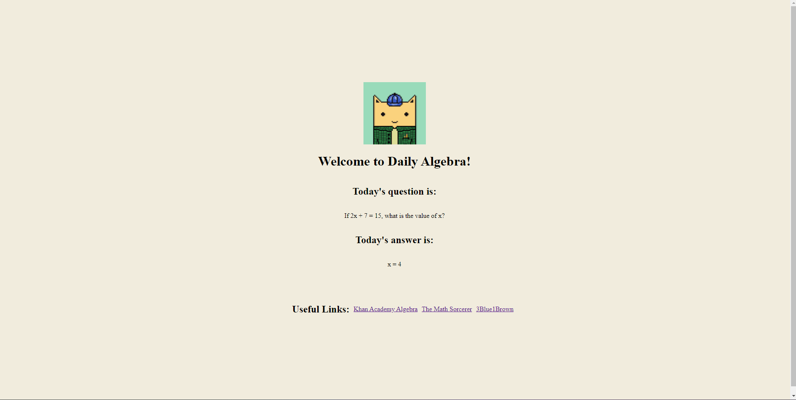

# Daily Algebra Exercises
I'm stuck on how to implement a 24-hour query logic at the moment. I'm not really familiar with app development and deploying on Heroku as well. I tried using Netlify, but it doesn't seem like my Flask app will work (it's dynamic?).

The intent is to have a new question-answer pair prompted every 24-hours, and it just picks the questions sequentially from ID = 1, ID = 2... ID = N.

I've got the app to render, but I'm struggling with implementing the time logic and hosting it on Heroku.

Cats are cool

Here's what it looks like:
<!--  -->
<!--  -->

